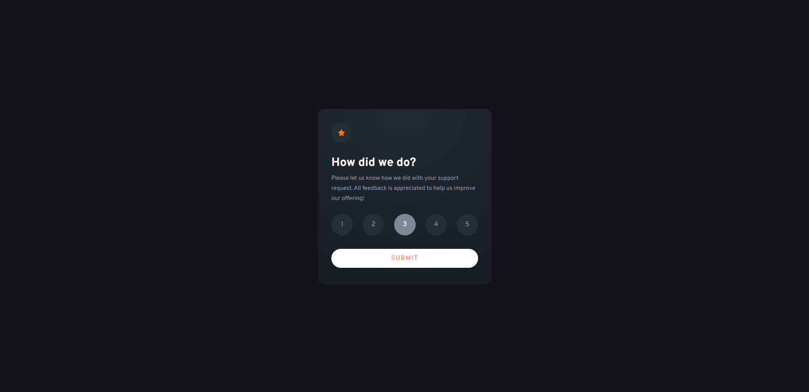
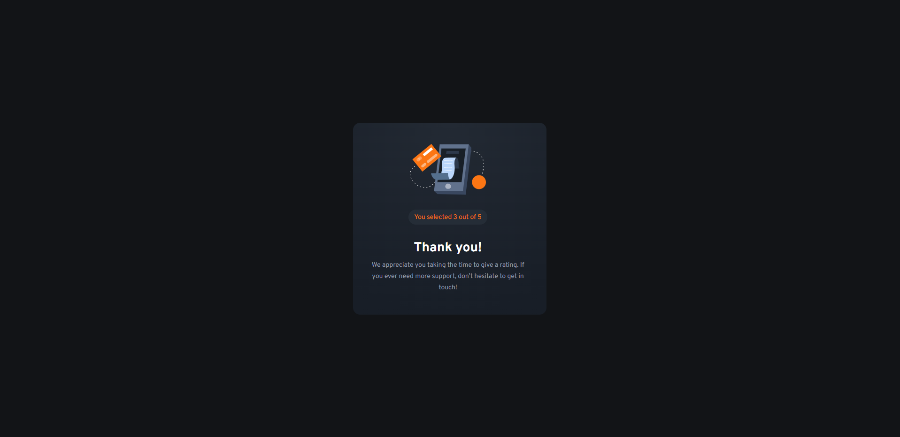
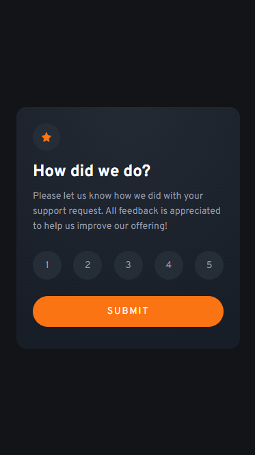

# Frontend Mentor - Interactive rating component solution

This is a solution to the [Interactive rating component challenge on Frontend Mentor](https://www.frontendmentor.io/challenges/interactive-rating-component-koxpeBUmI). Frontend Mentor challenges help you improve your coding skills by building realistic projects. 

## Table of contents

- [Overview](#overview)
  - [The challenge](#the-challenge)
  - [Screenshot](#screenshot)
  - [Links](#links)
- [My process](#my-process)
  - [Built with](#built-with)
  - [What I learned](#what-i-learned)
  - [Continued development](#continued-development)
  - [Useful resources](#useful-resources)
- [Author](#author)

## Overview

### The challenge

Users should be able to:

- View the optimal layout for the app depending on their device's screen size
- See hover states for all interactive elements on the page
- Select and submit a number rating
- See the "Thank you" card state after submitting a rating

### Screenshot

### Links

- Solution URL: [GitHub](https://github.com/Debesta/Frontend-Mentor---interactive-rating-component)
- Live Site URL: [Netlify](https://interactive-rating-component-debesta.netlify.app/)

## My process

### Built with

- Semantic HTML5 markup
- SCSS custom properties
- Flexbox
- Mobile-first workflow
- Vanilla JavaScript

### What I learned

It is my first project with JavaScript so it wasn't easy, but I think on the first time it's good.

### Continued development

In 100% I need to study JavaScript.

### Useful resources

- [MDN](https://developer.mozilla.org/en-US/docs/Web/API/Node/textContent) - This helped me with adding text to HTML by JavaScript

## Author

- GitHub - [@Debesta](https://github.com/Debesta)
- Frontend Mentor - [@Debesta](https://www.frontendmentor.io/profile/Debesta)
